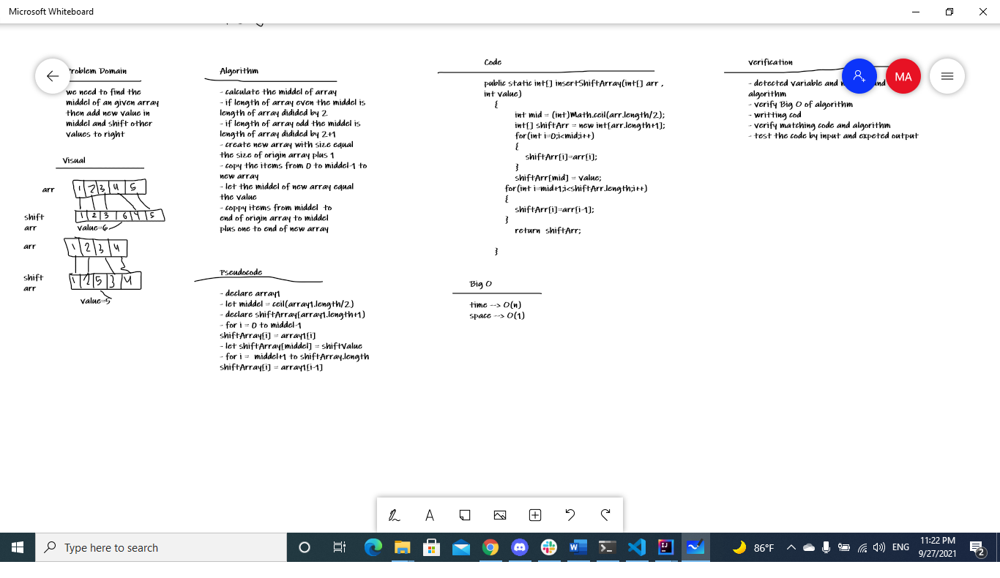

# Insert to Middle of an Array
<!-- Description of the challenge -->
Write a function called insertShiftArray which takes in an array and a value to be added. Without utilizing any of the built-in methods available to your language, return an array with the new value added at the middle index.

## Whiteboard Process
<!-- Embedded whiteboard image -->

## Approach & Efficiency
<!-- What approach did you take? Discuss Why. What is the Big O space/time for this approach? -->

- calculate the middel of array by ceil of divided length of  array by 2  
- create new array with size equal 
the size of origin array plus 1
- copy the items from 0 to middel-1 to 
new array
- let the middel of new array equal 
the value
- coppy items from middel  to
end of origin array to middel 
plus one to end of new array 
- Big O of  time is O(n) and space is O(1)