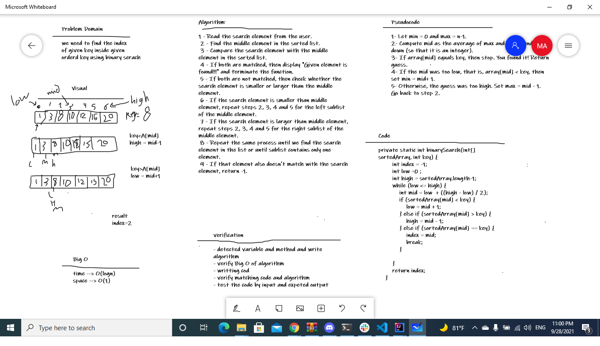

# Binary Search of Sorted Array
<!-- Description of the challenge -->
Write a function called BinarySearch which takes in 2 parameters: a sorted array and the search key. Without utilizing any of the built-in methods available to your language, return the index of the array’s element that is equal to the value of the search key, or -1 if the element is not in the array.

## Whiteboard Process
<!-- Embedded whiteboard image -->

## Approach & Efficiency
<!-- What approach did you take? Discuss Why. What is the Big O space/time for this approach? -->

 - Read the search element from the user.
  - Find the middle element in the sorted list.
  - Compare the search element with the middle element in the sorted list.
  - If both are matched, then display "Given element is found!!!" and terminate the function.
  - If both are not matched, then check whether the search element is smaller or larger than the middle element.
  - If the search element is smaller than middle element, repeat steps 2, 3, 4 and 5 for the left sublist of the middle element.
  - If the search element is larger than middle element, repeat steps 2, 3, 4 and 5 for the right sublist of the middle element.
  - Repeat the same process until we find the search element in the list or until sublist contains only one element.
  - If that element also doesn't match with the search element, return -1.
  - Big O of  time is O(logn) and space is O(1)

