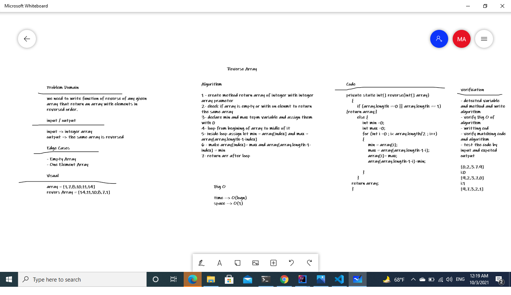

# Reverse an Array
<!-- Description of the challenge -->
finding the reverse of a given array 

## Whiteboard Process
<!-- Embedded whiteboard image -->

## Approach & Efficiency
<!-- What approach did you take? Discuss Why. What is the Big O space/time for this approach? -->
I use for loop to put array[i] in index [arrayLength-i+1] of other array have the reverse resulte and I used other loop to print the reverse array I think this take the O(n) time and O(1) space