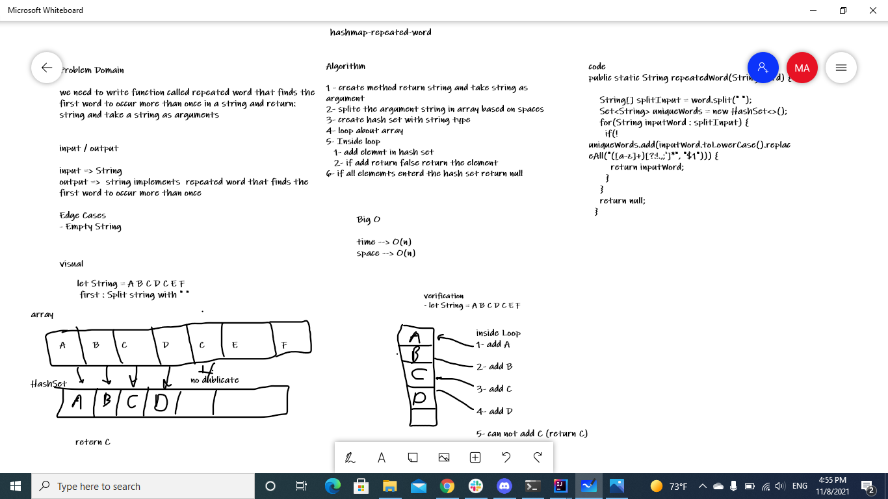

# Challenge Summary
we need to write function called repeated word that finds the first word to occur more than once in a string and return: string and take a string as arguments
## Whiteboard Process

## Approach & Efficiency
Algorithm

* 1 - create method return string and take string as argument
* 2- splite the argument string in array based on spaces
* 3- create hash set with string type
* 4- loop about array
* 5- Inside loop
  - 1- add elemnt in hash set
  - 2- if add return false return the element
* 6- if all elememts enterd the hash set return null
## Solution
[solution](./lib/src/main/java/hashmap/repeated/word/Library.java)
