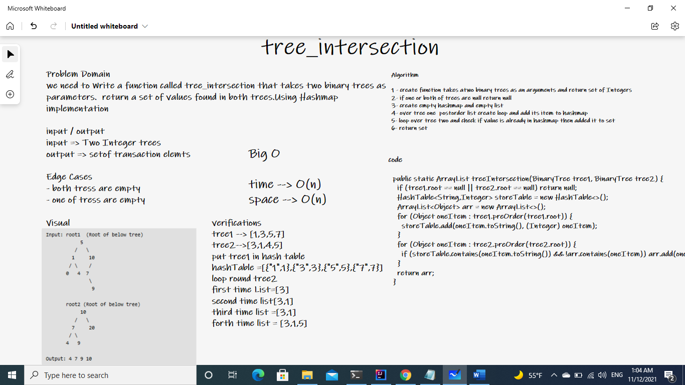
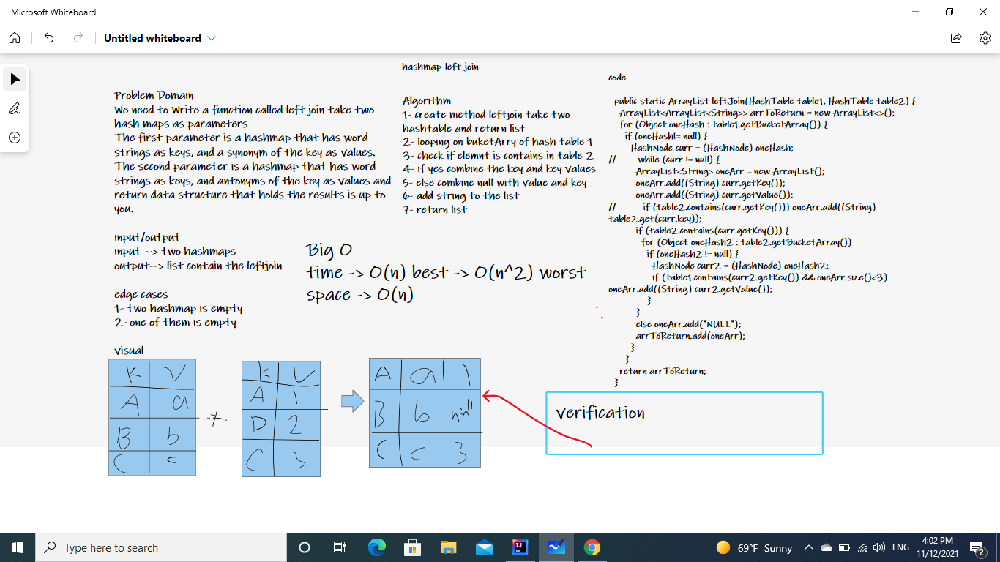

# Hashtables
a hash table  is a data structure that implements an associative array abstract data type, a structure that can map keys to values.
A hash table uses a hash function to compute an index, also called a hash code, into an array of buckets or slots, from which the desired value can be found.
During lookup, the key is hashed and the resulting hash indicates where the corresponding value is stored.
## Challenge
Implement a Hashtable Class with the following methods:

### add
  - Arguments: key, value
  - Returns: nothing
* ##### This method should hash the key, and add the key and value pair to the table, handling collisions as needed.
### get
  - Arguments: key
  - Returns: Value associated with that key in the table
### contains
  - Arguments: key
  - Returns: Boolean, indicating if the key exists in the table already.
### hash
  - Arguments: key
  - Returns: Index in the collection for that key

## Approach & Efficiency

| Algorithm	|	Average |	Worst case |
| -------- | ------ | ------ |
| Space |	O(n)[1]	| O(n) |
| Search |	O(1) | O(n) |
| Insert |	O(1)	|O(n) |
| Delete |	O(1)	| O(n) |

# Challenge 32
<!-- Description of the challenge -->

## Whiteboard Process

## Solution
[tree-transaction](./lib/src/main/java/TreeIntersection/TreeIntersection.java)

# Challenge 33
We need to Write a function called left join take two hash maps as parameters
The first parameter is a hashmap that has word strings as keys, and a synonym of the key as values.
The second parameter is a hashmap that has word strings as keys, and antonyms of the key as values and return data structure that holds the results is up to you.

## Whiteboard Process

## Solution
[tree-transaction](./lib/src/main/java/LeftJoin/leftJoin.java)
