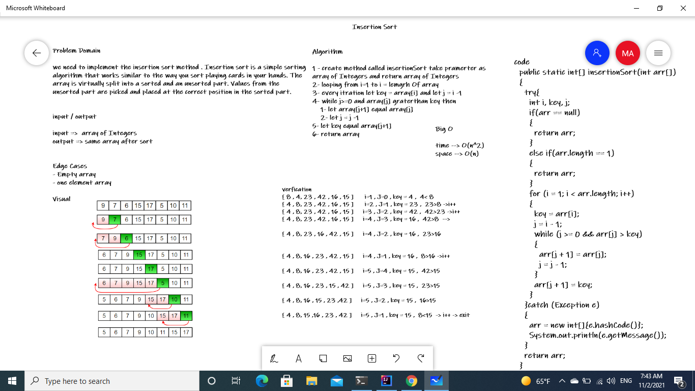

# Challenge 26: Insertion Sort
# Challenge Summary
we need to implement the insertion sort method .
Insertion sort is a simple sorting algorithm that works similar to the way you sort playing cards in your hands.
The array is virtually split into a sorted and an unsorted part.
Values from the unsorted part are picked and placed at the correct position in the sorted part.

## Whiteboard Process

## Approach & Efficiency
1 - create method called insertionSort take pramerter as array of Integers and return array of Integers
2- looping from i=1 to i = lemgrh Of array
3- every itration let key = array[i] and let j = i -1
4- while j>=0 and array[j] graterthan key then
1- let array[j+1] equal array[j]
2- let j = j -1
5- let key equal array[j+1]
6- return array
## Solution
[solution](./lib/src/main/java/insertion/sort/Library.java)
