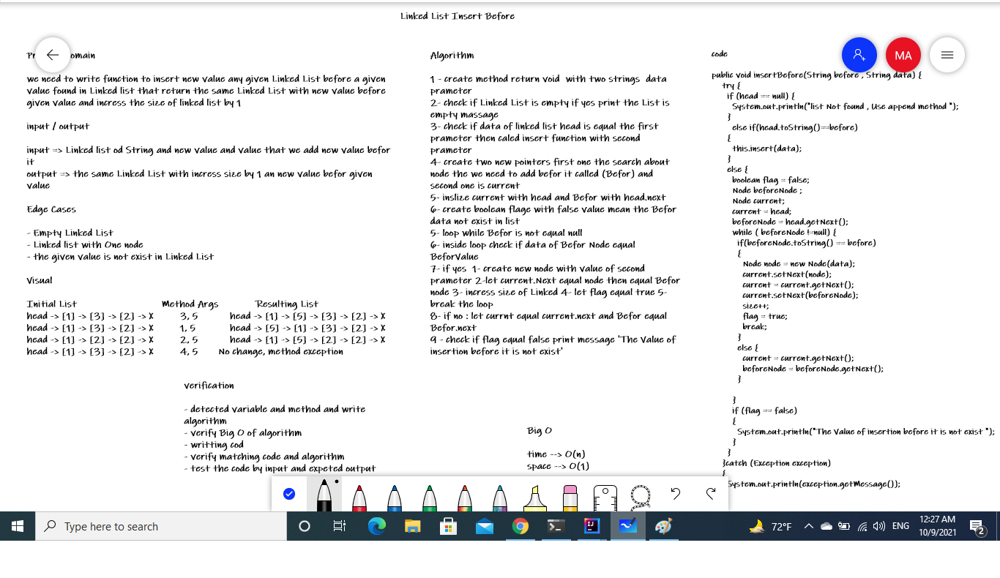

# Data Structure
# Linked List
## `Challenge-05` Linked List Implementation
A linked list is a sequence of data structures, which are connected together via links. Linked List is a sequence of links which contains items.
* ### Classes
- #### Node
   Node class that has properties for the value stored in the Node, and a pointer to the next Node.
- #### Linked List
  Linked List class, include a head property. Upon instantiation, an empty Linked List should be created.
    - ##### Features
      - ###### insert
        Void function to add a new node with that value to the head of the list with an O(1) Time performance.
        O(1) time and O(1) space
      - ###### includes
        Boolean function to indicate whether that value exists as a Node’s value somewhere within the list.
        O(n) time and O(1) space
      - ###### to string
         Function return a string for representing all the values in the Linked List, formatted as:
        "{ a } -> { b } -> { c } -> NULL"
      - O(n) time and O(1) space
## `Challenge-06` linked-list-insertions
# Challenge Summary
create three functions for Linked list class :
* 1- append(value) :function to append value in end of any given Linked List that return the same Linked List with new value in the end and increase the size of linked list by 1
* 2- insertBefor(data,value):function to insert new value any given Linked List before a given value found in Linked list that return the same Linked List with new value before given value and increase the size of linked list by 1
* 3- insertAfter(data,value) : function to insert new value any given Linked List after a given value found in Linked list that return the same Linked List with new value after given value and increase the size of linked list by 1
## Whiteboard Process
* ##### append function

* ##### insertBefor

* ##### insertAfter

## Approach & Efficiency
* ##### append function
1 - create method return void  with one string data prameter
2- check if Linked List is empty to give dtat to head node
3- declare current pointer indicate to head of linked list
5- loop while current.next pointer doesent indacte to null value
5- create new node with data
6 - let current.Next indicate to new node
7- lncrese the size of linked List by 1
8-Big O : time --> O(n)
space --> O(1)

* ##### insertBefor

1 - create method return void  with two strings  data prameter
2- check if Linked List is empty if yes print the List is empty massage
3- check if data of linked list head is equal the first prameter then caled insert function with second prameter
4- create two new pointers first one the search about node the we need to add befor it called (Befor) and second one is current
5- inslize current with head and Befor with head.next
6- create boolean flage with false value mean the Befor data not exist in list
5- loop while Befor is not equal null
6- inside loop check if data of Befor Node equal BeforValue
7- if yes  1- create new node with value of second prameter 2-let current.Next equal node then equal Befor node 3- incress size of Linked 4- let flag equal true 5- break the loop
8- if no : let currnt equal current.next and Befor equal Befor.next
9 - check if flag equal false print message 'The Value of insertion before it is not exist'
10-Big O : time --> O(n)
space --> O(1)
* ##### insertAfter
1 - create method return void  with two strings  data prameter
2- check if Linked List is empty if yes print the List is empty massage
3- check if data of linked list head is equal the first prameter then caled append function with second prameter
4- create two new pointers first one the search about node the we need to add after it called (After) and second one is current
5- inslize current with head.next  and After with head
6- create boolean flage with false value mean the After data not exist in list
5- loop while After.next is not equal null
6- inside loop check if data of After Node equal first function prameter
7- if yes  1- create new node with value of second prameter 2-let After.Next equal node then equal After node 3- incress size of Linked 4- let flag equal true 5- break the loop
8- if no : let currnt equal current.next and After equal After.next
9 - check if flag equal false print message 'The Value of insertion after it is not exist'
10-Big O : time --> O(n)
space --> O(1)

## `Challenge-07` linked-list-kth
# Challenge Summary
we need to write function return the value of node that is in given index from the end of linked list

## Whiteboard Process

## Approach & Efficiency
1 - create method return string with integer index prameter
2- check if Linked List is empty or index less than 0 or index greater than linked list size to throw the excption
3- declare current pointer indicate to head of linked list
4- loop from 0 to (size - index)
5- inside the loop let current = current.next
6- return the data insid the current

Big O : time --> O(n)
space --> O(1)

## `Challenge-08` linked-list-zip
# Challenge Summary
we need to write function called listzip take two listedlists
as prameters and return Linked List that Zip the
two linked lists together into one so that the
nodes alternate between the two lists and return
a reference to the head of the zipped list.
## Whiteboard Process

## Approach & Efficiency
1 - create method return linked list with two linked lists data prameter
2- check if two linked lists are empth then return empty linked list
3- check if one of them is empty then return the filling one
4- create current1 Node and let it equal list1.head and create current2 Node and let it equal list2.head
5- creat next1 Node and let it equal current1.next and creat next2 Node and let it equal current2.next
6- check if size of one them is greater than the second one
7 - looping while the next pointer  of small array not equal null
8- inside loop let 1- current2.next equal next1 2-  current1.next =current2  3- current1 =next1 4-current2 = next2 5-  next1 = next1.Next 6-   next2 = next2.Next
9- outside loop let current1.Next =current2 and current2.next = next1
10 - retun list1

Big O : time --> O(n)
space --> O(1)

