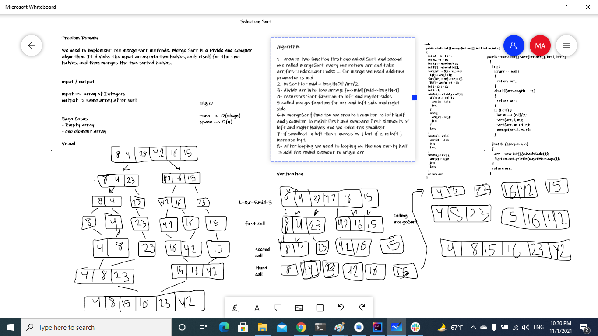

# Challenge 27: Merge Sort
# Challenge Summary
we need to implement the merge sort methode.
Merge Sort is a Divide and Conquer algorithm.
It divides the input array into two halves,
calls itself for the two halves, and then merges the two sorted halves.

## Whiteboard Process

## Approach & Efficiency
Algorithm

1 - create two function first one called Sort and second one called mergeSort every one return arr and take arr,firstIndex,LastIndex ... for merge we need additinal prameter is mid
2- in Sort let mid = lengthOf Arr/2
3- divide arr into tow arrays [o->mid][mid->length-1]
4- recursive Sort function to left and rigtht sides
5-called merge function for arr and left side and right side
6-in mergeSort function we create i counter to left half and j counter to right first and compare first elements of left and right halves and we take the smallest
7- if smallest in left the i incress by 1 but if is in left j increase by 1
8- after looping we need to looping on the non empty half to add the rmind element to origin arr
## Solution
[solution](./lib/src/main/java/merge/sort/Library.java)
