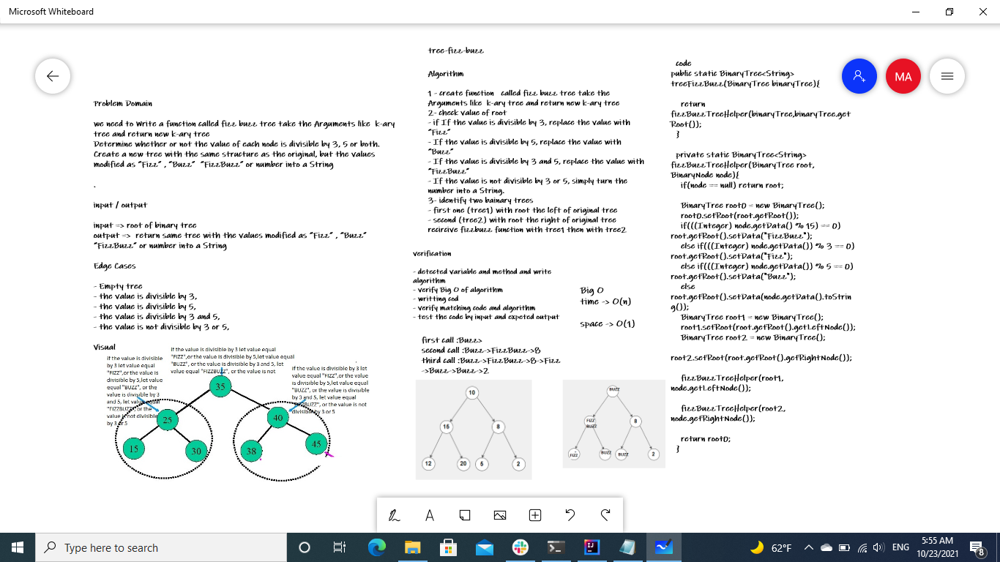

# Trees
## `Challenge-15` Binary Trees Implementation
A binary tree is a tree-type non-linear data structure with a maximum of two children for each parent. Every node in a binary tree has a left and right reference along with the data element. The node at the top of the hierarchy of a tree is called the root node. The nodes that hold other sub-nodes are the parent nodes.
* ### Classes
  - #### BinaryNode
    class that has properties for the value stored in the node, the left child node, and the right child node
    - #### BinarySearchTree
      Binary Search Tree class : This class should be a sub-class (or your languages equivalent) of the Binary Tree
      - ##### Features
        - ###### Add
          Return  nothing and Adds a new node with that value in the correct location in the binary search tree.
        - ###### Contains
           Returns boolean and indicating whether or not the value is in the tree at least once.

    - #### BinaryTree
      a Binary Tree class
      Define a method for each of the depth first traversals which returns an array of the values, ordered appropriately.
      - ##### Features
        - ###### pre order
          root-left-right
        - ###### in order
         left-root-right
        - ###### post order
         left-right-root
## `Challenge-16` Max-Tree
# Challenge Summary
 function Find the maximum value stored in the tree. with assuming that the values stored in the Binary Tree will be numeric.
## Whiteboard Process

## Approach & Efficiency
- 1 - create method return number with binryNode is root of binary tree
- 2- check if root is empty then return 0 and print massegr tree is empty
- 3- check if right of root is not null called the function as recurcive with right of root as new root
- 4- when the right of root become null then return the data of root
- 5- if type of data is not numeric then return 0 and throw Expetion
- `Big O`
  time -> best `O(1)`->worst `O(n/2)` -> avarege `O(logn)` space -> `O(1)`

## `Challenge-17` tree-breadth-first
# Challenge Summary
we need to Write a function called breadth first take Arguments as tree
and return list of all values in the tree, in the order they were encountered
## Whiteboard Process

## Approach & Efficiency
- 1 - create function return integer to calculate highte of tree
- 2- create two variables hight left and hight right with intial value 0
- 3- chek if left node is exist incress hight left then recursive hight function with root is left node
- 4- chek if right node is exist incress hight right then recursive hight function with root is right node
- 5- let hight is max between hight left and hight right
- 6- create function breadth first with prameter binary tree node and return list
- 7- first function with root node and loop form o to tree hight and recuseive function with left and right nodes
- `Big O`
  time -> `O(n)` , space -> `O(1)`

## `Challenge-18` tree-fizz-buzz
# Challenge Summary
we need to Write a function called fizz buzz tree take the Arguments like  k-ary tree and return new k-ary tree
Determine whether or not the value of each node is divisible by 3, 5 or both. Create a new tree with the same structure as the original, but the values modified as “Fizz” , “Buzz”  “FizzBuzz” or number into a String
## Whiteboard Process

## Approach & Efficiency
* 1 - create function   called fizz buzz tree take the Arguments like  k-ary tree and return new k-ary tree
* 2- check value of root
  - if If the value is divisible by 3, replace the value with “Fizz”
  - If the value is divisible by 5, replace the value with “Buzz”
  - If the value is divisible by 3 and 5, replace the value with “FizzBuzz”
  - If the value is not divisible by 3 or 5, simply turn the number into a String.
* 3- identify two bainary trees
  - first one (tree1) with root the left of original tree
  - second (tree2) with root the right of original tree
    recircive fizzbuzz function with tree1 then with tree2- `Big O`
    time -> `O(n)` , space -> `O(1)`

